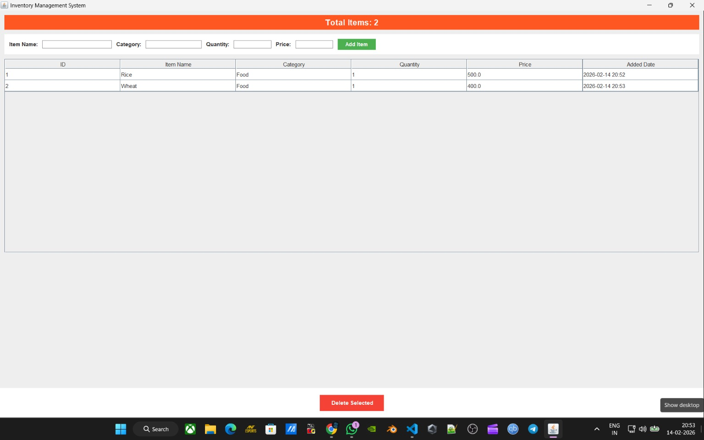
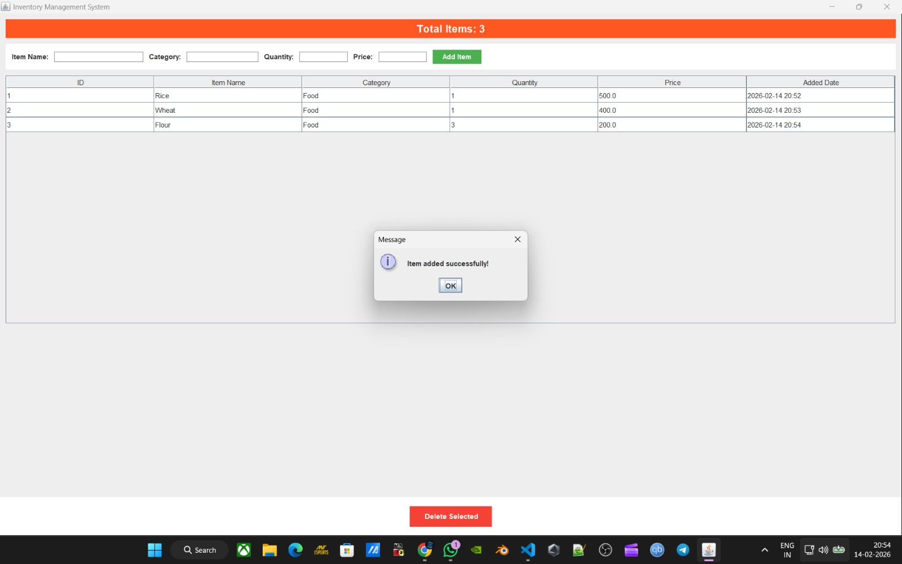
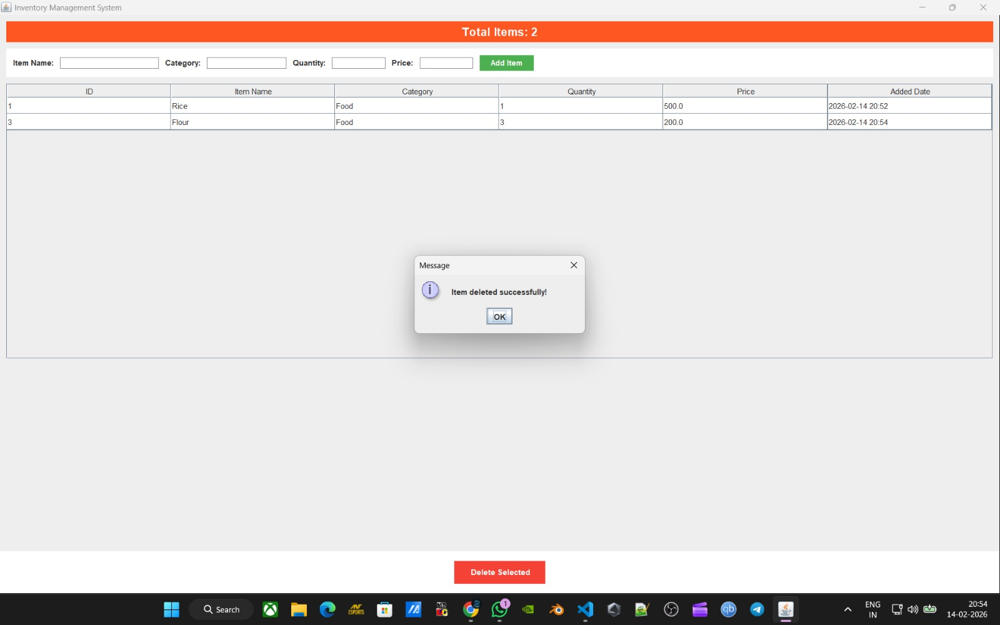

# Inventory Management System

**Team Members:** Jithu Dhanapalan & Arppan George Biju

## Problem Statement and Objective

Businesses need an efficient system to manage their product inventory and track stock levels. This Inventory Management System provides a user-friendly GUI application to maintain inventory records including item name, category, quantity, and price, with persistent storage using MySQL database.

## Features

- **Add Items**: Add new inventory items with name, category, quantity, and price
- **View Items**: Display all items in a tabular format with details
- **Delete Items**: Remove selected items from the database
- **Statistics**: Display total number of items in the inventory

## Technologies Used

- **Programming Language**: Java
- **GUI Framework**: Java Swing
- **Database**: MySQL
- **JDBC Driver**: MySQL Connector/J 8.3.0
- **Java Version**: JDK 8 or higher

## Steps to Run the Program

1. **Start MySQL Server** (ensure it's running on localhost:3306)

2. **Compile the Program:**
   ```bash
   javac -cp ".:mysql-connector-j-8.3.0.jar" InventoryManagementSystem.java
   ```

3. **Run the Program:**
   ```bash
   java -cp ".:mysql-connector-j-8.3.0.jar" InventoryManagementSystem
   ```

   **Note:** The application automatically creates the database (`inventory_db`) and table on first run.

## Screenshots






## Sample Test Cases

### Test Case 1: Add a New Item
**Input:**
- Item Name: "Laptop"
- Category: "Electronics"
- Quantity: 50
- Price: 999.99

**Expected Output:** Item successfully added to the inventory database with current date/time stamp

### Test Case 2: Delete an Item
**Input:**
- Select an item from the table (e.g., Item ID: 1)
- Click "Delete Selected" button

**Expected Output:** Item removed from database, table refreshed, total items count updated

### Test Case 3: Add Multiple Items
**Input:**
- Item 1: "Mouse", "Electronics", 100, 25.99
- Item 2: "Keyboard", "Electronics", 75, 45.50
- Item 3: "Monitor", "Electronics", 30, 299.99

**Expected Output:** All items successfully added to the inventory with unique IDs and timestamps

### Test Case 4: Empty Field Validation
**Input:**
- Leave any field empty and click "Add Item"

**Expected Output:** Show error message "Fill all fields!"
